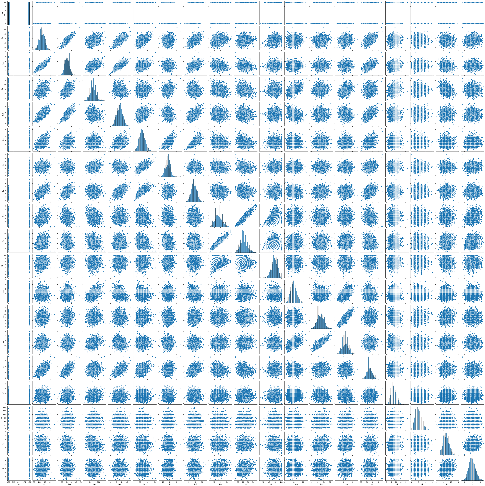
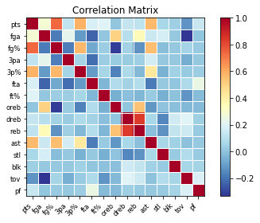

# MullaneyJamesDataMiningFinalProject

### Checklist
- [x] Proposal
- [x] Initial Data Collection
- [x] Data Manipulation
- [x] Information Presentation Draft 1
- [x] Poster Draft 1
- [x] Final Project: Repo
- [x] Final Project: Poster Final Draft

### Proposal

The idea is to use online data to find correlations in what stats lead what teams to win in this year’s march madness and use it to predict the future matches.

**EDIT: Since March Madness ended, I will be using NBA Stats and prediciting the outcome for the rest of the season.**

### Initial Data Collection

Stats gotten from: [NBA's Official Website](NBA.com)

Process:
  - NBA.com has access to every boxscore for every game in table format
  - Copy / paste into excel ( I tried to find a webmining way to do it and couldn't . . . but really if it's as easy as copy / paste I'm using it!)
  - Removed some unneccesary columns
  - Copy / paste team statistics into excel
  - Removed unneccesary columns
  - Adjusted team names ( New York Knicks -> NYK )

### Data Manipulation

 - Adjust dataset to show 'W' as 1 and 'L' as 0
```python
stats['res'] = np.where(stats['res'] == 'W', 1, 0)
```
 - change datatypes to float64 for regression, besides team of course
```python
for col in stats:
    if stats[col].dtype != 'object':
        stats[col] = stats[col].astype('float64')
```


### Information Presentation Draft 1

Initial information includes:
 - Pairplot

 - Correlation Matrix



Tools used:
 * NBA.com for stats
 * JupyterLab for workstation
 * Seaborn and statsmodels for data visualization
 * Pandas and numpy for csv reading and data manipulation
 * SKLearn for prediction models
